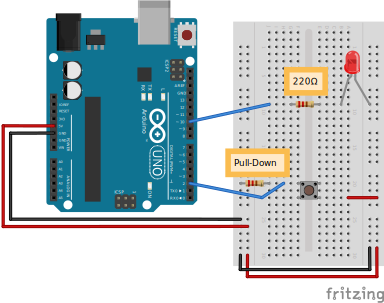

<h1 align=center>Taster mit Pull-Down-Wiederstand</h1>

## Bauteile

- Arduino UNO
- 220Ω Wiederstand
- 10kΩ Wiederstand (Pull-Down-Wiederstand)
- Leuchtdiode (LED)
- Taster
- 5 x Kabel

## Schaltaufbau

