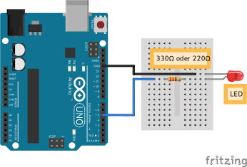

<h1 align=center>Led per PWM dimmen</h1>

## Bauteile

- Arduino UNO
- 220Ω Wiederstand (auch höhere Werte möglich, ABER: LED wird dunkler)
- Leuchtdiode (Light Emitting Diode, LED)
- 2 x Kabel

## Schaltaufbau

